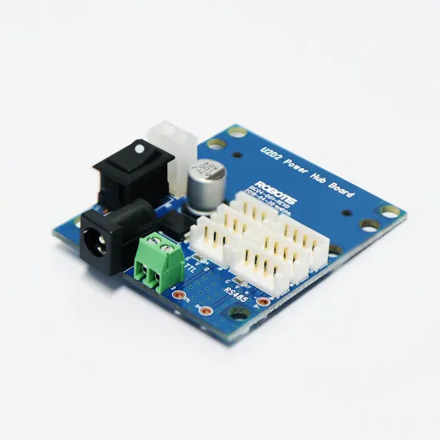

Présentation du matériel utilisé
================================

Cette section présente les composants essentiels nécessaires pour configurer un système performant basé sur le Raspberry Pi 5. Chaque élément est choisi pour maximiser les capacités de calcul, de stockage et de refroidissement du système.

************
Raspberry Pi
************

.. figure:: img/raspberry.jpg
   :align: center
   :width: 60%
   
La carte Raspberry Pi 5 est équipée d’un processeur ARM Cortex-A76 quadricœur cadencé à 2,4 GHz, offrant une augmentation significative des performances par rapport aux générations précédentes. Elle prend en charge jusqu’à 8 Go de RAM LPDDR4X, la rendant idéale pour les applications gourmandes en ressources, comme la robotique ou l'IA.

- **Raspberry Pi 5** :

  - Processeur : ARM Cortex-A76 quadricœur 2,4 GHz.
  - Mémoire : jusqu’à 8 Go LPDDR4X.
  - Connectivité : 2 ports USB 3.0, 2 ports micro-HDMI, Ethernet Gigabit.
  
Voir la `datasheet de la Raspberry Pi 5 <https://datasheets.raspberrypi.com/rpi5/rpi5-product-brief.pdf>`_.

*****************
Disque dur ADATA
*****************

.. figure:: img/disquedur.jpg
   :align: center
   :width: 60%

Le disque dur ADATA Legend 700 NVMe de 256 Go garantit une vitesse de lecture/écriture pouvant atteindre 2000 Mo/s, idéale pour les systèmes d’exploitation, les bases de données ou les projets nécessitant des temps de chargement rapides. Ce disque SSD compact et performant est compatible avec le port NVMe de la carte base.

- **Disque dur NVMe ADATA Legend 700** :

  - Capacité : 256 Go.
  - Interface : PCIe Gen3 x4.
  - Performances : Lecture/écriture jusqu’à 2000 Mo/s.
  
*************************
Radiateur pour Raspberry
*************************

.. figure:: img/radiateur.png
   :align: center
   :width: 60%

Le radiateur actif pour Raspberry Pi 5 est équipé d’un ventilateur intégré et de larges ailettes pour une dissipation thermique efficace. Conçu pour les charges de travail prolongées, il maintient les températures du processeur en dessous de 50 °C, garantissant une performance constante sans risque de throttling.
  
  - **Radiateur pour Raspberry** :

  - Matériau : Aluminium avec ventilateur intégré.
  - Usage : Dissipation thermique active pour applications intensives.
  
*************************
Carte dynamixel
*************************

La carte U2D2 Power Hub Board est une platine d’alimentation conçue pour être utilisée avec le module U2D2 afin de fournir une puissance stable à une large gamme de servomoteurs DYNAMIXEL, en TTL comme en RS‑485. Elle accepte une plage étendue de tension (environ 7,4 à 24 V) et propose plusieurs connecteurs d’alimentation (SMPS, bornier à vis, connecteur 2P), ainsi que des connecteurs 3 et 4 broches pour distribuer facilement puissance et signaux de communication aux actionneurs.

Voir la `datasheet de la U2D2 Power Hub Board <https://emanual.robotis.com/docs/en/parts/interface/u2d2_power_hub/>`_.

