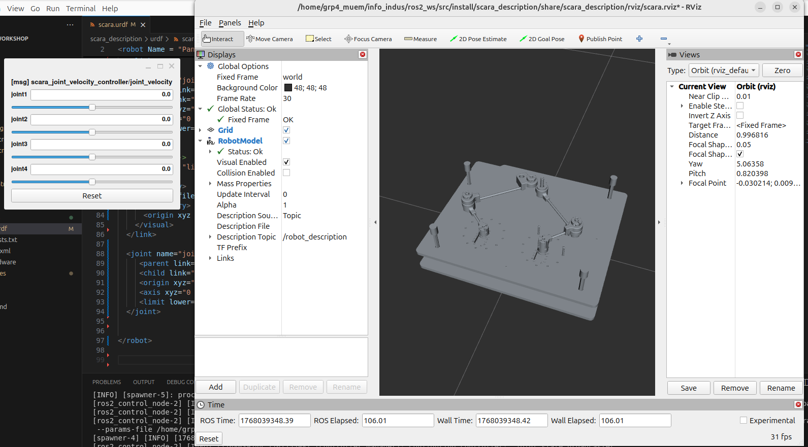

Description URDF du pantographe
===============================

Objectif du fichier URDF
------------------------

Le fichier URDF présenté décrit la structure cinématique du pantographe
utilisé dans le projet.  
Il permet :

- de lier les différentes mailles 3D (fichiers ``.dae``) ;
- de définir les articulations (revolute / continuous) entre les maillons ;
- de positionner correctement le robot dans l’environnement RViz.

Lien world et base du robot
---------------------------

Lien ``world``
^^^^^^^^^^^^^^

.. code-block:: xml

   <link name="world"/>

Ce lien abstrait sert de référence fixe.  
Il ne possède pas de géométrie mais permet d’ancrer le robot dans la scène.

Base du robot
^^^^^^^^^^^^^

.. code-block:: xml

   <link name="base_link">
     <visual>
       <geometry>
         <mesh filename="package://scara_description/urdf/meshes/base.dae"/>
       </geometry>
       <origin xyz="0 0 0" rpy="1.5708 0 0"/>
     </visual>
   </link>

Ici :

- ``base_link`` correspond à la base mécanique du pantographe ;
- la géométrie est fournie par le mesh ``base.dae`` ;
- la rotation ``rpy="1.5708 0 0"`` (≈ 90° autour de X) aligne le repère Creo
  avec le repère ROS pour que la base soit orientée correctement dans RViz.

Fixation au monde
^^^^^^^^^^^^^^^^^

.. code-block:: xml

   <joint name="joint_base_to_pantograph" type="fixed">
     <parent link="world"/>
     <child link="base_link"/>
   </joint>

Ce joint **fixe** ancre définitivement la base au lien ``world`` :
pas de mouvement possible, le pantographe est posé à un endroit fixe de la scène.

Lien et articulation 1
----------------------

Lien ``link1``
^^^^^^^^^^^^^^

.. code-block:: xml

   <link name="link1">
     <visual>
       <geometry>
         <mesh filename="package://scara_description/urdf/meshes/link1.dae"/>
       </geometry>
       <origin xyz="0 0 0" rpy="0 0 0"/>
     </visual>
   </link>

Le maillon ``link1`` représente le premier bras du mécanisme, avec son mesh
associé ``link1.dae``.

Joint ``joint1``
^^^^^^^^^^^^^^^^

.. code-block:: xml

   <joint name="joint1" type="revolute">
     <parent link="base_link"/>
     <child  link="link1"/>
     <origin xyz="-0.08 -0.07 0.035" rpy="0 0 0"/>
     <axis   xyz="0 0 1"/>
     <limit  lower="-3.14" upper="3.14" effort="10" velocity="1.0"/>
   </joint>

Ce joint :

- relie ``base_link`` (parent) à ``link1`` (enfant) ;
- est de type **revolute** (rotation limitée autour d’un axe) ;
- a pour axe ``xyz="0 0 1"`` : rotation autour de l’axe Z, comme une articulation
  de rotation plane classique.[web:407]

Les coordonnées ``origin xyz="-0.08 -0.07 0.035"`` définissent la position du
centre de rotation de ``link1`` **dans le repère de la base**.  
Pour obtenir ces valeurs, les distances ont été mesurées dans Creo à l’aide de
l’outil *Measure* (distances entre origines et repères), puis converties en
mètres pour être renseignées précisément dans l’URDF.  
Ce travail de mesure garantit que le pivot dans RViz se trouve exactement au même
endroit que l’axe mécanique réel.

Lien et articulation 2
----------------------

Lien ``link2``
^^^^^^^^^^^^^^

.. code-block:: xml

   <link name="link2">
     <visual>
       <geometry>
         <mesh filename="package://scara_description/urdf/meshes/link2.dae"/>
       </geometry>
       <origin xyz="0 0 0" rpy="0 0 0"/>
     </visual>
   </link>

Ce maillon représente le second bras du pantographe.

Joint ``joint2``
^^^^^^^^^^^^^^^^

.. code-block:: xml

   <joint name="joint2" type="revolute">
     <parent link="link1"/>
     <child  link="link2"/>
     <origin xyz="0.08 0 0.054" rpy="1.5708 0 0"/>
     <axis   xyz="0 1 0"/>
     <limit  lower="-3.14" upper="3.14" effort="10" velocity="1.0"/>
   </joint>

Caractéristiques :

- joint revolute entre ``link1`` et ``link2`` ;
- axe de rotation ``xyz="0 1 0"`` : rotation autour de Y ;
- l’orientation initiale est corrigée par ``rpy="1.5708 0 0"`` (rotation de 90°
  autour de X) pour aligner correctement le mesh avec l’axe mécanique.[web:407]

Les valeurs de position ``origin xyz="0.08 0 0.054"`` proviennent directement
des mesures dans Creo : distance entre le repère de ``link1`` et l’axe de
l’articulation 2.  
Ces mesures assurent que la deuxième articulation est physiquement cohérente,
et que les deux bras se referment correctement dans la simulation.

Lien et articulation 3
----------------------

Lien ``link3``
^^^^^^^^^^^^^^

.. code-block:: xml

   <link name="link3">
     <visual>
       <geometry>
         <mesh filename="package://scara_description/urdf/meshes/link4.dae"/>
       </geometry>
       <origin xyz="0 0 0" rpy="0 0 0"/>
     </visual>
   </link>

Ici ``link3`` est associé au mesh ``link4.dae`` (choix de nomenclature spécifique
au projet).

Joint ``joint3``
^^^^^^^^^^^^^^^^

.. code-block:: xml

   <joint name="joint3" type="revolute">
     <parent link="base_link"/>
     <child  link="link3"/>
     <origin xyz="0.058 -0.07 0.035" rpy="0 0 0"/>
     <axis   xyz="0 0 1"/>
     <limit  lower="-3.14" upper="3.14" effort="10" velocity="1.0"/>
   </joint>

Comme pour ``joint1`` :

- joint revolute, axe ``xyz="0 0 1"`` (rotation autour de Z) ;
- point d’attache défini par ``origin xyz="0.058 -0.07 0.035"``.

Ce point a été obtenu avec l’outil de mesure de Creo en prenant les distances
entre l’origine de la base et l’axe de rotation réel de ce bras.  
L’idée est que, lorsque l’angle du joint varie, la rotation se fasse exactement
autour du bon axe géométrique dans RViz.

Lien et articulation 4
----------------------

Lien ``link4``
^^^^^^^^^^^^^^

.. code-block:: xml

   <link name="link4">
     <visual>
       <geometry>
         <mesh filename="package://scara_description/urdf/meshes/link3.dae"/>
       </geometry>
       <origin xyz="0 0 0" rpy="-1.57 0 0"/>
     </visual>
   </link>

Ce maillon utilise le mesh ``link3.dae`` et est réorienté par ``rpy="-1.57 0 0"``
(≈ -90° autour de X) pour correspondre à la façon dont la pièce est montée
dans l’assemblage réel.

Joint ``joint4``
^^^^^^^^^^^^^^^^

.. code-block:: xml

   <joint name="joint4" type="continuous">
     <parent link="link3"/>
     <child  link="link4"/>
     <origin xyz="0.079 0 0.053" rpy="0 0 0"/>
     <axis   xyz="0 0 1"/>
     <limit  lower="-3.14" upper="3.14" effort="10" velocity="1.0"/>
   </joint>

Particularités :

- joint de type **continuous** : rotation libre (pas de butées physiques) ;
- axe de rotation autour de Z (``xyz="0 0 1"``) ;
- position de l’articulation ``origin xyz="0.079 0 0.053"`` calculée à partir
  des distances mesurées dans Creo entre le repère de ``link3`` et l’axe du
  dernier pivot.

Une fois encore, l’outil *Measure* de Creo a été utilisé pour récupérer :

- l’offset en X, Y, Z par rapport au repère parent ;
- la cohérence des axes entre la CAO et le modèle URDF.

Méthode générale pour placer les joints à partir de Creo
--------------------------------------------------------

Pour chaque articulation :

1. **Identifier le repère parent** dans l’assemblage Creo (par exemple celui de
   ``base_link`` ou de ``link1``).
2. **Utiliser l’outil de mesure** pour obtenir les coordonnées du centre
   géométrique de l’axe de rotation (en X, Y, Z) par rapport à ce repère.
3. **Convertir les distances** dans l’unité du URDF (mètres).
4. Renseigner ces valeurs dans l’attribut ``origin xyz="x y z"`` du joint
   correspondant.
5. Vérifier visuellement dans RViz que :
   - la rotation se fait autour du bon axe ;
   - les maillons restent bien alignés lors des mouvements.

Cette méthode garantit que le modèle URDF est fidèle à la CAO, et que les
mouvements observés dans RViz reflètent correctement la cinématique réelle
du pantographe.

Rendu final
------------

Finalement, ue fois le fichier complet, on peux lancer la visualisation avec la commande suivante:

.. code-block:: bash

   ros2 launch scara_bringup scara.launch.py 
   
Et le rendu est le suivant:

On peut apercevoir que la boucle du robot n'est pas fermée, cela est normal puisqu'il n'est pas possible de construire un robot parallèle avec RViz.

Nous avons décidé ici de couper le robot sur la liaison du milieu, et les 4 autres liaison peuvent être pilotées indépendamment en vitesse.

